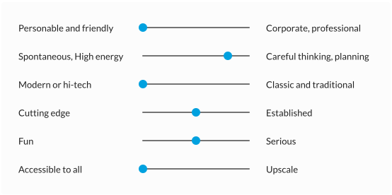

# Voice

Here you can find how we as a product sound. Our product personality consists of several character traits. Below, in the voice chart, you can read how we write when we want to convey a certain product principle.

## Personality

Let's say, our company were a human. What would we be like? That's our personality and how our texts sound like.

## Voice chart

Which product principle do you want to convey? Choose wisely and adapt your writing style accordingly.

| Product principles | Simplify | Automate | Connect | Build trust |
| ---- | ---- | ---- | ---- | ---- |
| Concepts | Short sentences, no jargon (technical terms), we get to the point | We take care of this, show clients the time they save, we do it like this but know that there are other ways to do it | Create a sense of unity, talk about our ecosystem, bring in partners (accountants > banks > apps) | Radiate competence (understand topics and present them in a simple manner), take clients seriously and consider where they are coming from, already think about the next step |
| Vocabulary | {Not vocabulary specific} | **Do:** automatic, fast, time saving, more time for … | **Do:** we, with our partners, ecosystem, bank interface, together; **Don't:** alone, the problem lies with …, We are not responsible | **Do:** Our research has concluded, also think of, we recommend, most do it like this; **Don't:** We know, that's not a mistake, it's not true, unfortunately |
| Verbosity | Use simple sentence structure, use short sentences, avoid nested sentences | Keep explanations as short as possible, use keywords and bulleted lists | Involve partners, how does it work with us and how with them | Describe the topic in detail, write one sentence more than usual |
| Grammar, Punctuation and Capitalization | [Duden](https://www.duden.de/) | | | |
